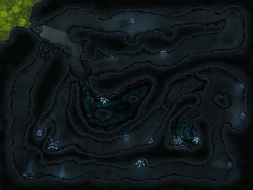

To make changes to the dungendraft map, you need the [FA Dungeondraft Integration 3.0](https://www.patreon.com/posts/56375276) asset pack from [Forgotten Adventures](https://www.forgotten-adventures.net/). The map was designed to be as minimal as clean as possible, though you can bring it to life with your own assets. Therefore, you best use the [FA Complete Mapmaking Pack](https://www.forgotten-adventures.net/product/map-making/assets/mapmaking-pack/).

Preview:

